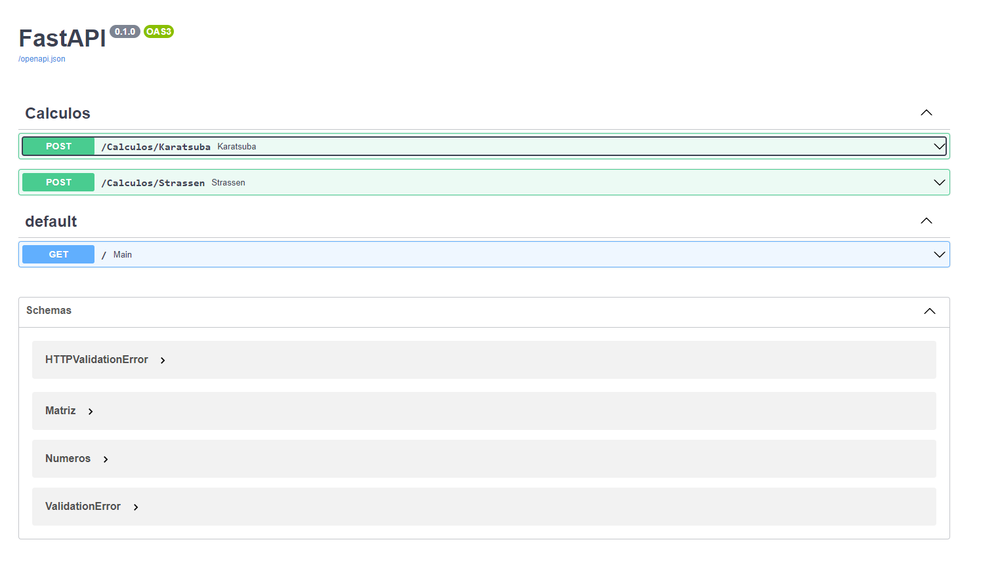
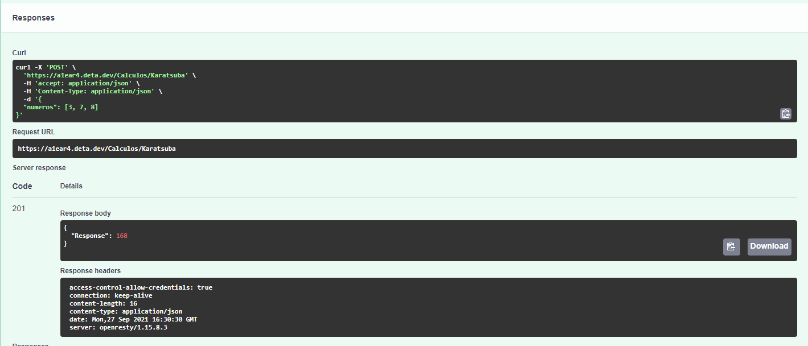
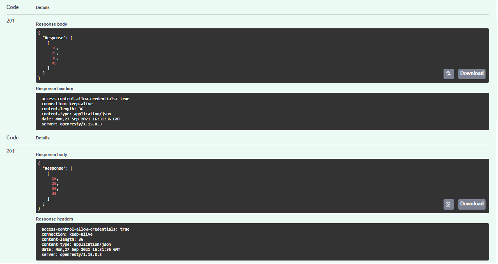

# Dividir e Multiplicar

**Número da Lista**: X<br>
**Conteúdo da Disciplina**: D&C<br>

## Alunos

| Matrícula  | Aluno                            |
| ---------- | -------------------------------- |
| 18/0054082 | Marcelo Victor de Sousa Silva    |
| 18/0029223 | Washington Bispo Arishita Junior |

## Sobre 

Esse projeto é uma API que utiliza-se suporta realizar 2 tipos de multiplicação que utilizam algoritimos de dividir e conquistar. O primeiro utiliza o algoritimo de Karatsuba para realizar a multiplicação de 2 ou mais números e o segundo utiliza o algoritimo de Strassen que realiza a multiplicação de matrizes quadradas com potência de 2 nas linhas e colunas.

## Screenshots





## Instalação 
**Linguagem**: python<br>
**Framework**: Fast API<br>

## Uso 

Para utilizar o projeto simplesmente vá até o link <https://a1ear4.deta.dev/docs#/Calculos/Strassen_Calculos_Strassen_post> e utilize o software de forma semelhante a mostrada no vídeo.

ou rode em seu próprio computador:

1 - certifique-se de ter já instalado o python em seu sistema
2 - instale o pip
3 - e instale as dependências mostradas logo abaixo

```
pip install fastapi
pip install uvicorn[standard]
pip install numpy
```
4 - por fim rode o projeto

```
cd FastAPI/
uvicorn main:app --reload
```

## Apresentação

O link da apresentação pode ser encontrado no seguinte link:

<https://youtu.be/EmwQWaWtHUA>

e também na pasta raiz com o nome:

```
./Apresentacao_DC.mp4
```